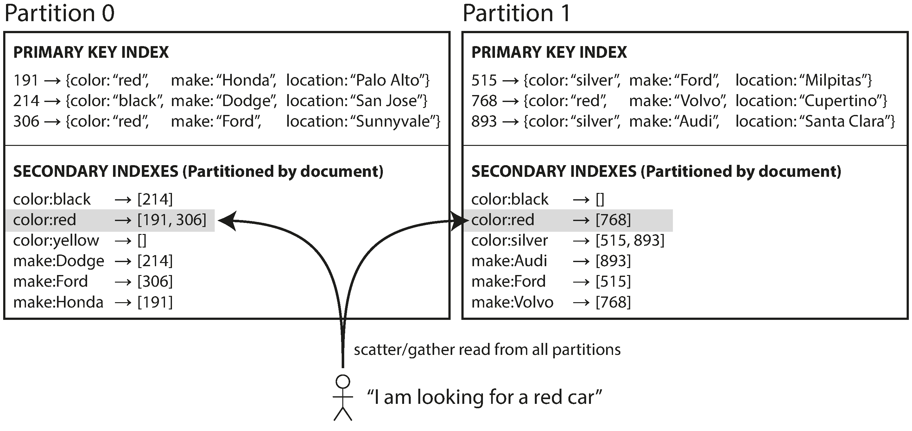
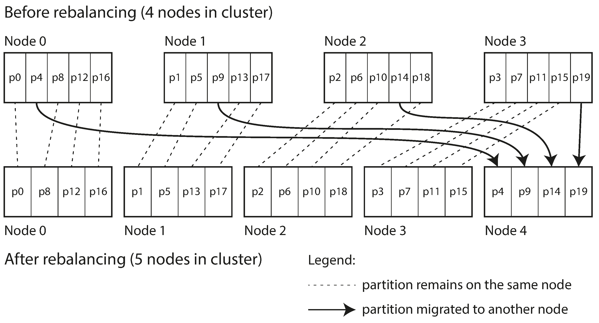

# 06. 파티셔닝

데이터셋이 매우 크거나 질의 처리량이 매우 높다면 복제만으로는 부족하고 데이터를 파티션으로 쪼갤 필요가 있다.

> 파티셔닝?
> 대용량 데이터베이스를 의도적으로 작은 단위로 쪼개는 방법을 말함
> 퍼포먼스(performance), 가용성(availability) 또는 정비용이성(maintainability)를 목적으로 논리적인 데이터 엘리먼트들을 다수의 엔티티(table)로 쪼개는 행위를 뜻하는 일반적인 용어
>
> 샤딩?
> 샤딩은 수평 파티셔닝(Horizontal partitioning)을 말함
> 스키마를 복제한 후 샤드키를 기준으로 나누는 것
>
> 수직 파티셔닝(Vertical partitioning)은 스키마를 나누어 분리 저장

파티션은 보통 각 데이터 단위(레코드, 로우, 문서)가 하나의 파티션에 속하게 된다.
데이터베이스가 여러 파티션을 동시에 건드리는 연산을 지원할 수도 있지만 결과적으로 각 파티션은 그 자체로 작은 데이터베이스가 된다.

데이터 파티셔닝을 하는 주된 이유는 <strong>확장성</strong>이다.

- 질의 부하를 여러 프로세서에 분산 가능
- 질의를 여러 노드에서 병렬 실행 가능

## 파티셔닝과 복제

보통 복제와 파티셔닝을 함께 적용해 각 파티션의 복사본을 여러 노드에 저장하여 내결함성을 보장한다.

> 내결함성?
> 시스템의 일부 구성 요소가 작동하지 않더라도 계속 작동할 수 있는 기능

함께 적용한다고 해도, 일반적으로 파티셔닝 방식과 복제 방식은 독립적으로 선택한다.

한 노드에 여러 파티션을 저장할 수 있다.

- 리더 팔로워 복제 모델

## 키-값 데이터 파티셔닝

파티셔닝의 목적은 데이터와 질의 부하를 노드 사이에 고르게 분산시키는 것이다.
이때, 파티셔닝이 고르게 이뤄지지 않아 다른 파티션보다 데이터가 많거나 질의를 많이 받는 파티션이 있다면 <strong>쏠렸다(Skewed)</strong>고 한다.

> 핫스팟?
> 불균형하게 부하가 높은 파티션을 말함

핫스팟을 회피하는 단순한 방법은 레코드를 할당할 노드를 무작위로 선택하는 것이다. 하지만 어떤 레코드를 읽으려고 할 때 해당 레코드가 어느 노드에 저장되었는지 알 수 없다.

키-값 데이터 모델은 항상 기본키를 통해 레코드에 접근한다는 특성을 이용하고,

- 키 범위 기준 파티셔닝
- 키의 해시값 기준 파티셔닝

등의 방식으로 파티셔닝하여 해당 레코드가 어느 노드에 저장되었는지 빠르게 찾는다.

### 키 범위 기준 파티셔닝

종이 백과사전처럼 각 파티션에 연속된 범위의 키를 할당한다.
각 범위들 사이의 경계를 알면 어떤 키가 어느 파티션에 속하는지 쉽게 찾을 수 있다.

키 범위 크기는 반드시 동일할 필요는 없다.
데이터를 고르게 분산시키려면 파티션 경계를 데이터에 맞춰 조정해야 한다.

각 파티션 내에서는 키를 정렬된 순서로 저장할 수 있다.

장점

- 범위 스캔이 쉬워짐
- 키를 연쇄된 색인으로 간주, 질의 하나로 관련 레코드 여러 개 읽을 수 있음

단점

- 특정한 접근 패턴이 핫스팟을 유발함

### 키의 해시값 기준 파티셔닝

쏠림과 핫스팟의 위험 때문에 많은 분산 데이터스토어는 키의 파티션을 정하는 데 해시 함수를 사용한다.

좋은 해시 함수는 쏠린 데이터를 입력으로 받아 균일하게 분산되게 한다.
각 파티션에 키 범위 대신 해시값 범위를 할당하고 해시값이 파티션의 범위에 속하는 모든 키를 그 파티션에 할당하면 된다.

장점

- 키를 파티션 사이에 균일하게 분산되게 함

단점

- 키 정렬 순서가 유지되지 않아 범위 질의를 효율적으로 실행할 수 없음

범위 기준 파티셔닝과 해시값 기준 파티셔닝의 각 장점을 누리기 위해서, 카산드라는 두 가지 파티셔닝 전략 사이에서 타협한다.

- 여러 칼럼을 포함하는 복합 기본키 지정
- 키의 첫 부분에만 해싱을 적용해 파티션 결정
- 남은 칼럼은 SS테이블에서 데이터를 정렬하는 연쇄된 색인으로 사용

### 쏠린 작업부하와 핫스팟 완화

항상 동일한 키를 읽고 쓰는 극단적인 상황에서는 모든 요청이 동일한 파티션으로 쏠리게 된다.

- 핫스팟을 완벽히 제거하기 어려움

요청이 매우 많이 쏠리는 키의 시작이나 끝에 임의의 숫자를 붙이는 방법 핫스팟을 회피할 수 있다.
하지만 다른 키에 쪼개서 쓰면 읽기를 실행할 때 추가적인 작업이 필요해진다.

현재는 데이터 시스템이 쏠린 작업부하를 자동으로 감지해 보정하기 어렵다.

- 애플리케이션에 대한 <strong>트레이드오프</strong>를 따져보아야 함

## 파티셔닝과 보조 색인

키-값 데이터 모델에 보조 색인이 추가되면 파티션에 깔끔하게 대응되지 않아 파티셔닝이 복잡해진다.

보조 색인이 있는 데이터베이스를 파티셔닝하는 방법

- 문서 기반 파티셔닝
- 용어 기반 파티셔닝

### 문서 기준 보조 색인 파티셔닝

각 항목에는 <strong>문서 ID(document ID)</strong>라고 부르는 고유 ID가 있고, 이것을 기준으로 파티셔닝한다.
지역 색인(local index)이라고도 함

장점

- 각 파티션은 완전히 독립적으로 동작함
- 자신의 보조 색인을 유지하며 그 파티션에 속하는 문서만 신경쓰면 됨

단점

- 문서 기준으로 파티셔닝된 색인을 써서 읽을 때는 모든 파티션으로 질의를 보내서 얻은 결과를 모두 모아야 함
- 특정 보조 색인에 대한 결과가 동일한 파티션에 저장된다는 보장이 없음

이러한 질의 방법을 <strong>스캐터/개더(scatter/gather)</strong>라고 하는데, 보조 색인을 써서 읽는 질의는 큰 비용이 들 수 있다.

### 용어 기준 보조 색인 파티셔닝

각 파티션이 자신만의 지역 색인을 갖게 하는 대신, 모든 파티션의 데이터를 담당하는 전역 색인(global index)을 만들 수 있다.
이때, 병목 현상을 해결하기 위해 용어 기준으로 전역 색인을 파티셔닝 할 수 있다.

> 용어란?
> 문서에 등장하는 모든 단어를 말함

색인을 파티셔닝 할 때,
용어 자체를 쓰면범위 스캔에 유리하고, 용어의 해시값을 쓰면 부하가 좀 더 고르게 분산된다.

장점

- 문서 파티셔닝에 비해 읽기가 효율적임
- 모든 파티션에 스캐터/개더를 실행할 필요 없음

단점

- 쓰기가 느리고 복잡함
- 단일 문서를 쓸 때 해당 색인의 여러 파티션에 영향을 줄 수 있음

색인을 항상 최신 상태로 유지하고 변경점을 실시간으로 반영하려면 분산 트랜잭션을 실행해야하는데, 모든 데이터베이스에서 분산 트랜잭션을 지원하지 않는다.

현실에서는 전역 보조 색인은 대개 비동기로 갱신된다.

## 파티션 재균형화

시간이 지나면서 데이터베이스에 변화가 생기는데, 부하를 균일하게 분산시키기 위해 <strong>파티션 재균형화(rebalancing)</strong>가 필요하다.

파티션 재균형화의 최소 요구사항

- 재균형화 후, 부하가 균등하게 분배되어야 함
- 재균형화 중 데이터베이스 정상 동작
- 노드들 사이에 데이터가 필요 이상으로 옮겨져서는 안 됨

### 재균형화 전략

키의 해시값 기준으로 파티셔닝할 때 해시값 범위를 나누기 위해 해시값에 그냥 mod N 연산을 하는 것은 좋지 않다.

- 노드 개수 N이 바뀌면 대부분의 데이터가 이동해야 해 비용이 지나치게 커짐

이처럼 데이터를 필요 이상으로 이동하는 경우를 피할 수 있는 방법으로 파티션 재균형화를 진행해야 한다.

### 파티션 개수 고정

처음부터 파티션을 노드 대수보다 많이 만들고 각 노드에 여러 파티션을 할당한다.

- 클러스터에 노드가 추가되면 새 노드는 기존 노드에서 파티션 몇 개를 뺏어옴
- 노드가 제거되면 반대로 수행함

장점

- 파티션만 노드 사이에서 통째로 이동하고, 파티션 개수, 할당된 키는 변경되지 않음

단점

- 전체 데이터셋의 크기 변동이 심하면 적절한 파티션 개수를 정하기 어려움

데이터베이스를 처음 구축할 때 고정할 파티션 개수를 정하게 되는데, 관리 측면, 데이터셋 등을 고려해서 정해야 한다.

파티션 개수가 너무 크면?

- 개별 파티션의 관리 오버헤드가 있으므로 역효과 있을 수 있음

개별 파티션의 크기도 고려해야한다.

파티션이 너무 크면?

- 재균형화를 실행할 때와 노드 장애로부터 복구할 때 비용이 큼

파티션이 너무 작으면

- 오버헤드가 너무 커진다.

### 동적 파티셔닝

데이터셋의 크기에 따라 파티션을 동적으로 만들어 파티션 재균형화를 수행한다.

파티션 크기가 설정된 값을 넘어서면 쪼개거나, 파티션 크기가 설정된 값 아래로 떨어지면 인접한 파티션과 합친다.
(B 트리의 최상위 레벨에서 실행되는 작업과 유사함)

장점

- 파티션 개수가 전체 데이터 용량에 맞춰 조정됨 

단점

- 빈 데이터베이스는 파티션 경계에 대한 사전 정보가 없음

모든 요청이 하나의 노드에서 실행되고 다른 노드들은 유휴 상태인데, 이를 완화하기 위해 초기 파티션 집합을 설정할 수 있게 한다. (<strong>사전 분할(pre-splitting)</strong>이라고 함)

동적 파티셔닝은 키 범위 파티셔닝, 해시 파티셔닝 모두에 사용될 수 있다.

### 노드 비례 파티셔닝

파티션 개수를 노드 대수에 비례하게 한다.
(노드당 할당되는 파티션 개수를 고정)

노드 대수가 일정할 때는 개별 파티션의 크기가 데이터셋 크기에 비례해서 증가하지만, 노드 대수를 늘리면 파티션 크기는 작아진다.

장점

- 개별 파티션의 크기가 안정적으로 유지된다.

1. 새 노드가 클러스터에 추가됨
2. 고정된 개수의 파티션을 무작위로 선택해 분할함
3. 분하된 파티션의 절반은 그대로 두고 다른 절반은 새 노드에 할당함

단점

- 파티션을 무작위로 선택해서 균등하지 않은 분할이 생길 수 있음

여러 파티션에 대해 평균적으로 보면 새 노드에 균등하게 분배되고, 회피할 수 있는 알고리즘이 있다.

파티션 경계를 무작위로 선택하려면 해시 기반 파티셔닝을 사용해야 한다.

### 운영: 자동 재균형화와 수동 재균형화

자동 재균형화

- 유지보수하기 편리하지만, 예측하기 어려움

수동 재균형화

- 자동 재균형화보다는 느릴 수 있지만, 예상치 못한 일을 방지할 수 있음

적절하게 중간 지점을 찾아 운영하는 것이 좋다.

## 요청 라우팅

파티션이 재균형화되면서 노드에 할당되는 파티션이 바뀌는데, 클라이언트에서 요청을 보낼 때 어느 노드로 접속해야하는지 알아야 한다.

위 방법들의 핵심은 라우팅 결정을 내리는 구성요소가 노드에 할당된 <strong>파티션의 변경 사항을 어떻게 아느냐</strong>다.

많은 분산 데이터 시스템은 <strong>주키퍼(ZooKeeper)</strong> 같은 별도의 코디네이터 서비스를 사용한다.

> 주키퍼(ZooKeeper)란?
> 분산 코디네이션 서비스를 제공하는 오픈소스 프로젝트
>
> 클러스터에서 구성 서버들끼리 공유되는 데이터를 유지하거나 어떤 연산을 조율하기 위해 주로 사용됨

주키퍼 이외에도 자체적인 설정 서버(Config server), 가십 프로토콜(gossip protocol), 목시(moxi) 등을 사용하여 라우팅 계층을 설정한다.

### 병렬 질의 실행

분석용으로 자주 사용되는 <strong>대규모 병렬 처리(massively parallel processing, MPP)</strong> 관계형 데이터베이스 제품은 훨씬 더 복잡한 종류의 질의를 지원한다.

MPP 질의 최적화기는 복잡한 질의를 여러 실행 단계와 파티션으로 분해한다.

이렇게 복잡한 질의를 효율적으로 잘 처리하려면 대용량 데이터셋의 파티셔닝이 잘 되어 있어야 한다.

## 정리

많은 데이터를 저장하고 처리하는데 부하가 균등하게 분산되지 않으면 핫스팟이 발생하므로, 적절한 파티셔닝이 필요하다.

이때 데이터셋의 크기 등을 고려하여 적합한 파티셔닝 전략을 선택하는 것이 중요하고, 파티션 재균형화도 고려해야한다.

주요 파티셔닝 기법

- 키 범위 파티셔닝
- 해시 파티셔닝

보조 색인 파티셔닝 기법

- 문서 파티셔닝 색인
- 용어 파티셔닝 색인

파티션 재균형화 전략

- 파티션 개수 고정
- 동적 파티셔닝
- 노드 비례 파티셔닝