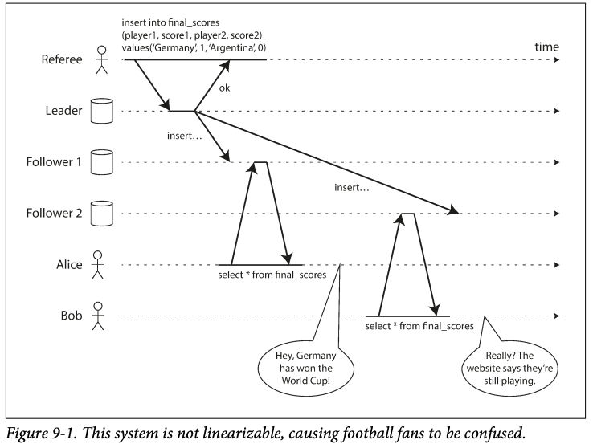
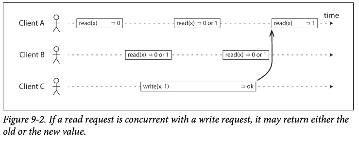
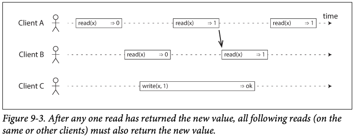
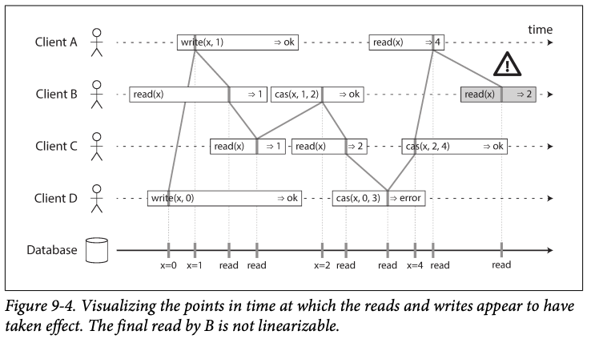
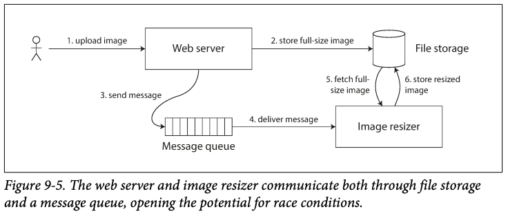
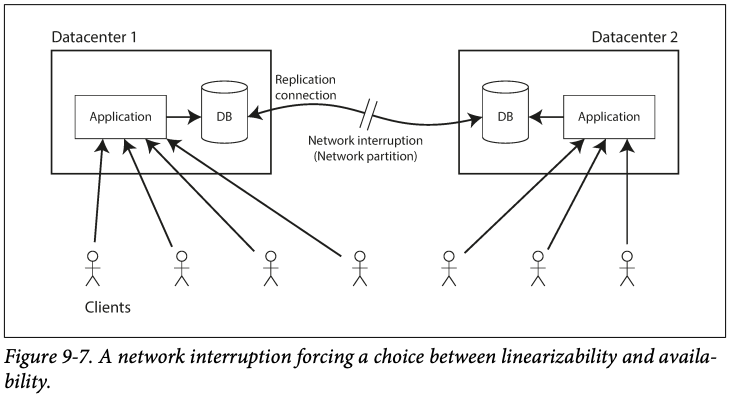
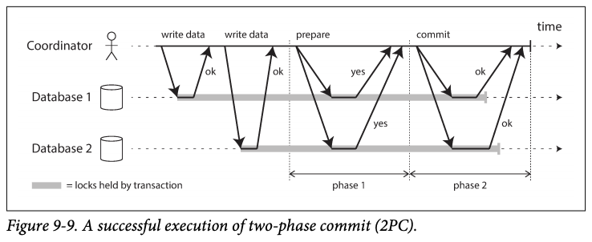

# 9. 일관성과 합의
이번 장에서는 분산 시스템의 내결함성을 구축하는 알고리즘과 프로토콜에 대해 다룬다. 내결함성을 지닌 시스템을 구축하는 가장 좋은 방법은 유용한 보장을 해주는 범용 추상화를 찾아 이를 구현하고 애플리케이션에서 이 보장에 의존하게 하는 것이다.

예를 들어, 분산 시스템에서 **합의**는 가장 중요한 추상화 중 하나이다. 즉, 모든 노드가 어떤 것에 동의하도록 만드는 것이다. 합의 구현을 통해 단일 리더 복제 방식에서 리더에게 장애가 발생시 새로운 리더를 뽑아서, 스플릿 브레인등의 문제를 피할 수 있다.

## 일관성 보장
- 복제 데이터베이스는 대부분 최소한 **최종적 일관성**을 제공하는데, 이는 다시 말해 데이터베이스에 쓰기를 멈추고 특정 시간을 기다리다보면 결국 모든 읽기가 같은 값을 반환한다는 점이다. 이런 의미에서 **수렴** 이 더 적당한 단어일지도 모른다.
- 그러나, 언제 복제본이 수렴될지는 알 수 없으므로 이는 매우 약한 보장이다.
- 이번 장에서는 데이터 시스템이 선택적으로 제공할 수 있는 더욱 강한 일관성 모델을 살펴본다.

## 선형성
- 선형성은 공통적으로 사용되는 갖아 강한 일과성 모델 중 하나이다.

- 선형성의 기본 아이디어는 시스템에 데이터 복사본이 하나만 있고 그 데이터를 대상으로 수행하는 모든 연산은 원자적인 것처럼 보이게 만드는 것이다.
- 선형성 시스템에서는 클라이언트가 쓰기를 성공적으로 완료하자마자 그 데이터베이스를 읽는 모든 클라이언트는 방금 쓰여진 값을 볼 수 있어야 한다. 다시 말해, **최신성 보장(recency guarantee)** 이다.
- 그림 9-1은 비선형성 시스템의 예이다.

- 그림 9-2는 선형성 데이터베이스에서 동시에 같은 키 x를 읽고 쓰는 세 클라이언트를 보여준다. 분산 시스템에서 x를 레지스터라고 부른다. 그림 9-2에서는 클라이언트 관점의 요청만 보여주고 데이터베이스 내부는 보여주지 않는다. 
- 그림 9-2 만으로는 "데이터 단일 복사본"을 모방하는 시스템에 기대하는 바인 "선형성"을 완전히 설명하기엔 부족하다. 그림 9-3 처럼 또 다른 제약 조건을 추가해야한다.

- 선형성 시스템에서는 x의 값이 원자적으로 0에서 1로 바뀌는 어떤 시점이 있다고 상상한다. 따라서 한 클라이언트의 읽기가 새로운 값 1을 반환하면 이후 모든 읽기 또한 1을 반환해야한다. 쓰기 연산이 아직 완료되지 않았더라도 말이다.

- *cas(x, v_old, v_new) => r* 은 클라이언트가 원자적 **compare-and-set** 연산을 요청했다는 뜻이다.
- 그림 9-4의 각 연산에는 우리가 연산이 실행됐다고 생각(가정)하는 시점이 수직선으로 표시되어있다. 이 표시들은 모여서 순차열을 이루며 그 결과는 레지스터에 실행된 읽기와 쓰기의 유효한 순차열이 돼야 한다.
- 선형성의 요구사항은 연산 표시를 모은 선들이 항상 시간순으로 진행돼야하고, 절대 뒤로 가서는 안된다는 것이다.

### 선형성에 기대기
- 어떤 환경에서 선형성이 유용할까? 스포츠 시합의 결과가 몇 초 뒤쳐진다고해서 실질적인 손해를 유발할 가능성은 거의 없다. 그러나 시스템이 올바르게 동작하도록 만들기 위해 선형성이 중요한 요구사항이 되는 영역이 몇가지 있다.

    ### 1) 잠금과 리더 선출 
    - 단일 리더 복제 *(클라이언트는 모든 쓰기를 단일 노드(리더)로 전송하고, 리더는 데이터 변경을 다른 복제 서버로 전송하는 시스템)* 시스템은 리더가 여러 개 (스플릿 브레인)이 아니라 하나만 존재하도록 보장해야한다. 리더를 선출하는 한 가지 방법은 잠금을 사용하는 것이다. 이 잠금을 어떻게 구현하든지 선형적이어야 한다.

    ### 2) 제약 조건의 유일성 보장
    - 사용자명이나 이메일 주소는 사용자 한 명을 유일하게 식별할 수 있어야하며, 파일 저장 서비스에서는 경로와 파일 이름이 유일해야 한다. 데이터가 기록될 때 이러한 제약 조건을 강제하고 싶다면 선형성이 필요하다.

    ### 3) 채널 간 타이밍 의존성
    

    - 사용자가 사진을 올릴 수 있고 백그라운드 프로세스가 사진을 저해상도 크기로 바꾸는 웹사이트가 있다고 하자.
    - 파일 저장 서비스가 선형적이면 이 시스템은 잘 동작한다. 그러나 단계 2에서 저장이 완료되기전에 단계 4 메세지 전달이 먼저 완료된다면?
    - 이 문제는 웹서버와 이미지 크기 변경 모듈 사이에 두 가지 다른 통신 채널(파일 저장소, 메세지 큐)가 있기 때문에 발생한다. 선형성이 두 통신 채널간의 경쟁 조건을 회피하는 유일한 방법은 아니지만 이해하기에 가장 단순하다.

### 선형 시스템 구현하기
- 단일 리더 복제(선형적이 될 가능성이 있음): 리더나 동기식으로 갱신된 팔로워에서 실행한 읽기는 선형적이 될 가능성이 있다.
- 합의 알고리즘(선형적): 단일 리더 복제와 비슷하지만 합의 프로토콜에는 스플릿 브레인과 복제본이 뒤쳐지는 문제를 막을 수단이 포함된다.
- 다중 리더 복제(비선형적): 여러 노드에서 동시에 쓰기를 처리하고 그 내용을 비동기로 다른 노드에 복제하기 때문에 비선형적이다.
- 리더 없는 복제(아마도 비선형적): 다이나모 스타일에서 엄격한 정족수를 사용한 읽기 쓰기는 선형적으로 보이지만 네트워크 지연의 변동이 심하면 경쟁조건이 생길 수 있다.

### 선형성의 비용

- 두 데이터센터 사이에 네트워크가 끊기면?
- 다중 리더 데이터베이스: 비선형적이지만 가용성이 높다
- 단일 리더 복제: 팔로워 데이터센터로 접속한 클라이언트들은 리더로 연결할 수 없으므로 데이터베이스에 아무것도 쓸 수 없고 선형성 읽기도 전혀 할 수 없다.

### 선형성과 네트워크 지연
- 선형성은 유용한 보장이지만 현실에서 실제로 선형적인 시스템은 매우 드물다. 최신 다중코어 CPU의 RAM조차 선형적이지 않다.
- 선형성을 제거한 이유는 성능을 위해서다.

## 순서화 보장
- 순서화는 이 책에서 되풀이된 주제이며 이는 순서화가 중요한 근본적 아이디어일 수 있음을 시사한다. (5장 단일 리더 복제, 7장 직렬성, 8장 타임스탬프와 시계 사용)
- 순서화가 계속 나오는 이유 중 하나는 순서화가 **인과성**을 보존하는데 도움을 준다는 것이다.
- 인과성은 이벤트에 순서를 부과한다. ex) 결과가 나타나기전에 원이이 발생한다. 메세지를 받기 전에 메시지를 보낸다. 답변하기 전에 질문을 한다.
- 인과적 순서가 전체 순서는 아니다. 선형성 시스템에서는 연산의 전체 순서를 정할 수 있지만, 두 이벤트에 인과적인 관계가 있으면 이들에는 순서가 있지만 동시에 실행되면 비교할 수 없다. 따라서 선형성은 인과성을 내포한다고 할 수 있다.
- 시스템은 선형적으로 만드는 성능 손해를 유발하지 않고도 인과적 일관성을 만족시킬 수 있다.

### 인과적 의존성 담기
- 비선형성 시스템이 어떻게 인과적 일관성을 유지할 수 있는지에 관한 모든 핵심 세부 사항을 다루진 않고 핵심 아이디어 중 일부만 간단히 살펴본다.
- 인과성을 유지하기 위해 어떤 연산이 다른 연산보다 **먼저 실행됐는지** 알아야 한다.
- 모든 인과적 의존성을 실제로 추적하는 것은 실용성이 떨어진다. 그래서 **일련번호** 나 **타임스탬프**를 사용하여 이벤트의 순서를 정할 수 있다. 일련번호나 타임스탬프는 크기가 작고 **전체 순서**를 제공한다. 즉 모든 연산은 고유 일련번호를 갖고 항상 두 개의 일련번호를 비교해서 어떤것이 나중에 실행됐는지를 결정할 수 있다.
- 단일 리더 복제를 쓰는 데이터베이스에서는 복제 로그가 인과성에 일관적인 쓰기 연산의 전체 순서를 정의한다. 리더는 연산마다 카운터를 증가시키고 복제 로그의 각 연산에 단조 증가하는 일련번호를 할당하기만 하면 된다.

### 전체 순서 브로드캐스트
- 프로그램이 단일 CPU 코어에서만 실행된다면 연산의 전체 순서를 정하기 쉽다. 그러나 분산 시스템에서는 모든 노드에서 연산의 전체 순서가 동일하도록 합의하기가 까다롭다.
- 단일 리더 복제의 문제는 처리량이 단일 리더가 처리할 수 있는 수준을 넘어서거나 리더에 장애가 발생했을 때 이다.
- 분산 시스템 분야에서 이 문제는 **전체 순서 브로드캐스트** 나 **원자적 브로드캐스트**로 알려져있다.
- 전체 순서 브로드캐스트는 보통 노드 사이에 메시지를 교환하는 프로토콜로 기술되며, 신뢰성 있는 전달과 전체 순서가 정해진 전달이라는 두 가지 속성을 항상 만족해야 한다.
- 전체 순서 브로드캐스트는 데이터베이스 복제에 딱 필요한 것이다. 모든 메세지가 데이터베이스에 쓰기를 나타내고 모든 복제 서버가 같은 쓰기 연산을 같은 순서로 처리하면 복제 서버들은 서로 일관성 있는 상태를 유지한다. 이 원리를 **상태 기계 복제**라고 한다.
- 전체 순서 브로드캐스트의 중요한 측면은 메세지가 전달된 시점에 그 순서가 고정된다는 것이다. 따라서 전체 순서 브로드캐스트는 타임스탬프 순서화보다 강하다.
- 또 다른 관점은 **로그**를 만드는 방법 중 하나라는 것이다. 모든 노드가 같은 메세지를 같은 순서로 전달해야 하므로 모든 노드는 로그를 읽어서 순서가 동일한 메세지를 볼 수 있다.
- 어떤 노드가 메세지 4를 전달하고 일련 번호가 6인 메세지를 받았다면 메세지 6을 전달하기 전에 메세지 5를 기다려야 한다는 것을 알 수 있다.

## 분산 트랜잭션과 합의
- 합의의 목적은 여러 노드들이 뭔가에 동의하게 만드는 것이다. 합의가 중요한 상황은 **리더 선출**이나 **원자적 커밋**이 있는데, 이번 절에서는 원자적 커밋을 더 자세히 살펴본다.
- 원자적 커밋을 해결하는 가장 흔한 방법은 2단계 커밋(2PC) 알고리즘이다. (아주 좋은 방법은 아니다.)

### 2단계 커밋 소개
- 2단계 커밋은 여러 노드에 걸친 원자적 트랜잭션 커밋을 달성하는, 즉 모든 노드가 커밋되거나 모든 노드가 어보트되도록 보장하는 알고리즘이다.
- 2PC의 기본 흐름이 그림 9-9에 설명돼 있다.

- 2PC는 단일 노드 트랜잭션에서 보통 존재하지 않는 새로운 컴포넌트인 **코디네이터**를 사용한다.
- 어플리케이션이 커밋할 준비가 되면 코디네이터가 1단계를 시작하여, 각 노드에 **준비** 요청을 보내서 커밋할 수 있는지 물어본다.
- 모든 참여자가 준비 됐다는 응답을 하면 코디네이터는 2단계에서 **커밋** 요청을 보내고, 각 노드에서 커밋이 실제로 일어난다. 참여자 중 누구라도 준비가 안되어있다면 2단계에서 모든 노드에 **어보트** 요청을 보낸다.
- 그러나 모든 참여자가 준비 요청을 받고 "네"에 투표했는데, 코디네이터에 장애가 생기면 각 참여자는 코디네이터로부터 커밋 혹은 어보트 지시를 받을 때 까지 기다릴 수 밖에 없다. 돌아갈 수 없는 지점에 있기 때문이다. 이런 상태에 있는 참여자의 트랜잭션을 **의심스럽다(in doubt)** 또는 **불확실하다(uncertain)** 고 한다. 이러한 사실 때문에 2단계 커밋을 **블로킹** 원자적 커밋 프로토콜이라고 부른다.

### 내결함성을 지닌 합의
- 합의 문제는 보통 다음과 같이 형식화된다. 하나 또는 그 이상의 노드들이 값을 **제안할** 수 있고 합의 알고리즘이 그 값 중 하나를 **결정한다**. 이 형식에서 합의 알고리즘은 다음 속성을 만족해야한다.
    - 균일한 동의: 어떤 두 노드도 다르게 결정하지 않는다.
    - 무결성: 어떤 노드도 두번 결정하지 않는다.
    - 유효성: 한 노드가 값 v를 결정한다면 v는 어떤 노드에서 제안된 것이다.
    - 종료: 죽지 않은 모드 노드는 결국 어떤 값을 결정한다.
- 내결함성이 상관없다면 처음 세 개의 속성을 만족시키는 것은 쉽다. 종료 속성은 내결함성의 아이디어를 형식화한다. 이 속성은 본질적으로 합의 알고리즘은 머물러 있지 않고 진행되어야 한다고 규정한다. 합의 시스템 모델은 노드가 죽으면 그 노드가 사라져서 결코 돌아오지 않는다고 가정한다. 물론 모든 노드가 죽는다면 어떤 알고리즘이라도 아무것도 결정할 수 없다. 따라서 알고리즘이 견딜 수 잇는 장애의 수에는 제한이 있다.
- 어떤 합의 알고리즘이라도 종료를 보장하려면 최소한 노드의 과반수가 올바르게 동작해야 한다.
- 내결함성을 지닌 합의 알고리즘 중 가장 널리 알려진 것은 뷰스탬프 복제, 팍소스, 라프트, 잽이다. 이러한 알고리즘에 공통으로 있는 고수준의 아이디어정도만 다루도록 한다.
- 이 알고리즘 중 대다수는 실제로는 위에서 설명한 형식적 모델(동의, 무결성, 유효성, 종료 속성)을 직접 사용하지 않는다. 대신 그것들의 값의 **순차열(sequence)**에 대해 결정해서 **전체 순서 브로드캐스트** 알고리즘을 만든다.
- 전체 순서 브로드캐스트는 모든 노드에게 메세지가 정확히 한 번, 같은 순서로 전달돼야 한다는 점을 기억하자. 이것은 합의를 몇 회 하는 것과 동일하다. 각 회마다 노드들은 다음에 보내기 원하는 메세지를 제안하고 전체 순서 상에서 전달될 다음 메세지를 결정한다. 그래서 전체 순서 브로드캐스트는 합의를 여러 번 반복하는 것과 동일하다.
    - 합의의 동의 속성 때문에 모든 노드는 같은 메세지를 같은 순서로 전달하도록 결정한다.
    - 무결성 속성 때문에 메세지는 중복되지 않는다.
    - 유효성 속성 때문에 메세지는 오염되지 않고 난데없이 조작되지 않는다.
    - 종료 속성 때문에 메세지는 손실되지 않는다.
- 지금까지 설명한 합의 프로토콜은 모두 내부적으로 어떤 형태로돈 리더를 사용하지만 리더가 유일하다고 보장하지는 않고 그보다는 약한 보장을 한다.
- 이 프로토콜들은 에포크 번호, 투표 번호, 뷰 번호, 텀 번호라는 개념을 정의하고 각 에포크 내에서는 리더가 유일하다고 보장한다. 현재 리더가 죽었다고 생각될 때마다 새 노드 선출을 위한 투표가 시작된다.
- 이 선출은 에포크 번호를 단조 증가시켜 전체 순서가 있게한다. 두 가지 다른 에포크에 있는 두 가지 다른 리더 사이에 충돌이 있으면 에포크 번호가 높은 리더가 이긴다.
- 리더는 뭔가를 결정하도록 허용하기 전에 에포크 번호가 더 높은 다른 리더가 없는지 먼저 확인해야 한다. 노드의 정족수로부터 투표를 받아서 리더는 제안이 찬성되기를 기다려야 한다. 노드는 에포크 번호가 더 높은 다른 리더를 알지 못할 때만 제안에 찬성하는 투표를 한다.
- 따라서 두 번의 투표가 있다. 한 번은 리더 선츨을 위해, 두 번째는 리더의 제안에 투표하기 위해서다. 중요한 것은 두 번의 투표를 하는 정족수가 겹쳐야 한다는 점이다.
- 제안에 대한 투표를 할 때 에포크 번호가 더 큰 것이 있다고 밝혀지지 않았더라면 현재 리더는 에포크 번호가 더 높은 리더 선출이 발생하지 않았다고 결론을 내려서 자신이 여전히 리더임을 확신할 수 있다.
- 합의 알고리즘은 분산 시스템의 커다란 발전이지만 모든 곳에서 쓰이진 않는다. 제안이 결정되기 전에 노드가 제안에 투표하는 과정은 일종의 동기식 복제이다. 사람들은 더 나은 성능을 위해 잠재적 손실이 있을 수 있는 비동기식 복제를 사용하기도 한다.